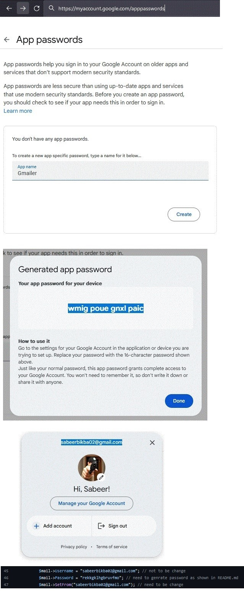

# Gmailer

Gmailer is a simple PHP project that demonstrates how to send emails using [PHPMailer](https://github.com/PHPMailer/PHPMailer) and [Gmail](https://mail.google.com/mail/).

## Overview

This project provides a basic form to input recipient email, subject, and message. It utilizes [PHPMailer](https://github.com/PHPMailer/PHPMailer), a popular PHP library for sending emails, to connect to [Gmail's](https://mail.google.com/mail/) SMTP server and send emails securely.

## Prerequisites

Before using this project, ensure you have the following prerequisites:

- PHP installed on your server or local environment.
- A Gmail account to use as the sender. You will need to enable "Less secure app access" in your Gmail account settings.

## Installation

1. Clone the repository to your local machine:

   ```bash
   # create directory & navigate to it 
   mkdir Gmailer ; cd Gmailer
   
   # intialize and clone repository
   git init ; git clone https://github.com/your-username/gmailer.git


2.  Create a Gmail App Password:
- Go to your Gmail account settings.
- Navigate to "Security" and find "App passwords" or "Less secure app access."
- Generate a new app password for the project.

3.  Find the following lines and update with your Gmail credentials:

```php
$mail->Username = "your-email@gmail.com";
$mail->Password = "your-gmail-app-password";
$mail->SetFrom("your-email@gmail.com");
```

